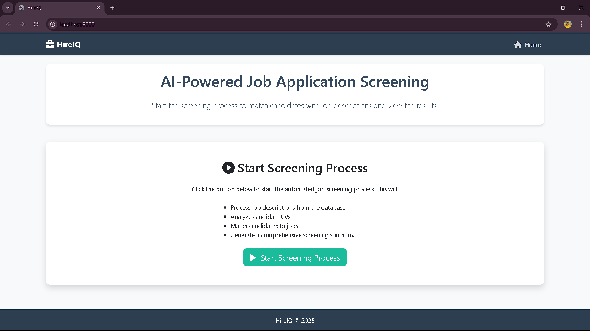
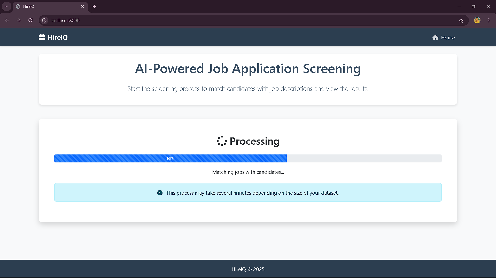
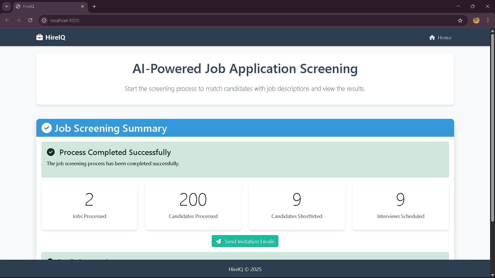

# HireIQ: AI-Powered Job Application Screening System

An advanced job application screening system that uses AI to process CVs, match candidates with job descriptions, and streamline the hiring process. The system features a web interface and API for easy integration.

## Key Features

- **Cloud-Based LLM Integration**: Uses Qwen2.5:0.5b model hosted on AWS EC2 for powerful AI capabilities
- **Custom Multi-Agent Framework**: Coordinates specialized agents for different parts of the screening process
- **Vector Embeddings**: Uses local nomic-embed-text model for semantic search and matching
- **Web Interface**: Clean, responsive UI with a simple one-click process and progress tracking
- **RESTful API**: FastAPI-powered endpoints for programmatic access
- **SQLite Database**: Stores job descriptions, candidate data, and matching results
- **Optimized Performance**: Parallel processing, caching, and efficient matching algorithms
- **PDF Processing**: Handles PDF format CVs and extracts text content

## Screenshots

- **Dashboard**



- **Pipeline Processing**


- **End Result**


## System Architecture

The system uses a multi-agent architecture where specialized agents work together:

1. **CV Processor Agent**: Extracts data from CVs including skills, experience, qualifications
2. **JD Summarizer Agent**: Processes job descriptions to extract requirements
3. **Efficient Matcher**: Compares jobs and candidates using embeddings and LLM analysis
4. **Scheduler Agent**: Handles interview scheduling for shortlisted candidates
5. **Web Interface**: Visualizes results and allows interaction with the system

## Setting Up

### Prerequisites

- Python 3.9+ 
- Access to Qwen2.5:0.5b model API endpoint on AWS EC2
- Basic dependencies (see requirements.txt)

### Installation

1. Clone this repository
2. Install dependencies:
   ```
   pip install -r requirements.txt
   ```
3. Configure your AWS EC2 endpoint in the configuration file

### Local Embeddings Setup

The system now supports using the `nomic-embed-text` library locally for embeddings. This provides faster processing and eliminates dependency on remote embedding services.

#### Setting up local embeddings:

1. Make sure `nomic` is installed:
   ```
   pip install nomic==2.0.15
   ```

2. Run the local embeddings setup script:
   
   **Windows:**
   ```
   setup_local_embeddings.bat
   ```
   
   **Unix/Mac:**
   ```
   ./setup_local_embeddings.sh
   ```

3. To test the local embeddings:
   ```
   python test_embeddings.py
   ```

You can switch between local and remote embeddings by changing the `USE_LOCAL_EMBEDDINGS` setting in `config.py`.

## Usage

### Running the Web Application

The simplest way to start the application is to run:

```
python start_application.py
```

This will start the FastAPI server that serves the web UI. You can access:
- Web interface: http://localhost:8000/

> **Note:** Always use `localhost` to access the application in your browser, not `0.0.0.0`.


### Using the Web Interface

The application features a simplified one-page interface:

1. **Start Process**: Click the "Run Matching Process" button to begin the job screening pipeline
2. **View Progress**: Watch real-time progress as the system processes data
3. **Review Results**: Once completed, the screening summary appears showing job matches and top candidates
4. **Explore Details**: Click on job or candidate links to view detailed information

The process typically takes a few minutes depending on your dataset size and computer performance.

### What the Pipeline Does

1. **Reset Database**: Clears previous data and prepares for a new run
2. **Process Job Descriptions**: Extracts requirements from job postings
3. **Process CVs**: Extracts skills and qualifications from candidate resumes
4. **Match Candidates**: Uses AI to match candidates to jobs
5. **Shortlist Candidates**: Selects the best candidates for each job
6. **Generate Summary**: Creates a comprehensive job screening summary

## Frontend Features

The web interface provides the following features:

1. **Home Page**: Lists all job descriptions and allows you to run the matching process
2. **Job Details**: Shows details of a specific job and its matched candidates
3. **Candidate Details**: Shows details of a specific candidate and their skills

## API Documentation

The system provides a RESTful API for programmatic access:

### Job Endpoints

- `GET /api/jobs` - List all job descriptions
- `GET /api/job/{job_id}` - Get job description details
- `GET /api/job/{job_id}/matches` - Get candidate matches for a job

### Candidate Endpoints

- `GET /api/candidates` - List all candidates
- `GET /api/candidate/{candidate_id}` - Get candidate details

### Process Endpoints

- `POST /api/start-process` - Start the job screening process
- `GET /api/process-status` - Get the current status of the process
- `POST /api/run-matching` - Run the matching process (optionally for a specific job)

## Implementation Details

### BaseAgent and Multi-Agent Framework

The system uses a custom multi-agent framework with a BaseAgent class that provides:

- Cloud-based LLM integration with Qwen2.5:0.5b
- Tool registration and usage
- Agent messaging
- State management

### AWS EC2 Integration

The system connects to an AWS EC2 instance hosting:

- **LLM Processing**: Using Qwen2.5:0.5b for analyzing text, summarization, and generating insights
- **Skills Extraction**: Identifying skills and requirements from text

### FastAPI Integration

The system uses FastAPI for:

- RESTful API endpoints
- Web interface serving
- Dependency injection
- API documentation

## Project Structure

```
├── main.py               # Main entry point for the full pipeline
├── start_application.py  # Script to start the web application
├── run_web_app.py        # Utility to run the FastAPI server
├── app.py                # Backend pipeline implementation
├── api/                  # API and web interface
│   ├── main.py           # FastAPI application
│   ├── templates/        # Jinja2 templates
│   └── static/           # Static assets
├── config.py             # Configuration settings
├── efficient_matcher.py  # Optimized matching system
├── reset_db.py           # Database reset utility
├── agents/               # Agent modules
│   ├── cv_processor.py   # CV processing agent
│   ├── jd_summarizer.py  # Job description summarizer
│   └── scheduler_agent.py # Interview scheduler
├── database/             # Database modules
│   ├── db_manager.py     # Database manager
│   └── init_db.py        # Database initialization
├── Dataset/              # Dataset directory for job descriptions and CVs
├── utils/                # Utility modules
│   ├── ollama_client.py  # Ollama LLM client
│   ├── embeddings.py     # Embedding utilities
│   └── pdf_extractor.py  # PDF data extraction
└── requirements.txt      # Dependencies
```

## Troubleshooting

### Common Issues

1. **Can't access the web interface**
   - Make sure to use `http://localhost:8000` in your browser, not `0.0.0.0:8000`
   - Check if the server is running without errors
   - Ensure port 8000 is not being used by another application

2. **Process doesn't start or gets stuck**
   - Check your connection to the AWS EC2 instance
   - Verify that the Qwen2.5:0.5b model is running properly on the EC2 instance
   - Look at the logs for any error messages
   - Try resetting the database with `python reset_db.py`

3. **Database issues**
   - Run `python reset_db.py` to reset the database if you encounter database errors

4. **PDF processing issues**
   - Ensure the PyPDF2 package is installed
   - For scanned PDFs, you might need OCR software
   - Check if the PDF files are accessible and not corrupted

5. **AWS connectivity issues**
   - Check your network connection
   - Verify that the EC2 instance is running
   - Ensure proper API keys and credentials are configured
   - Confirm the endpoint URL is correct in your configuration

## Logs

The application generates logs in the following locations:
- Main application log: `app.log`
- Web application log: `logs/web_app.log`
- API log: `logs/api.log`

These logs can be helpful for troubleshooting issues.
